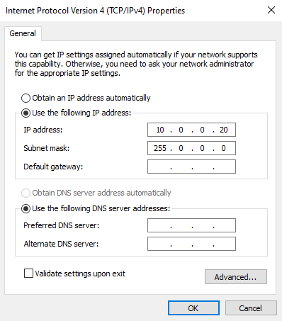
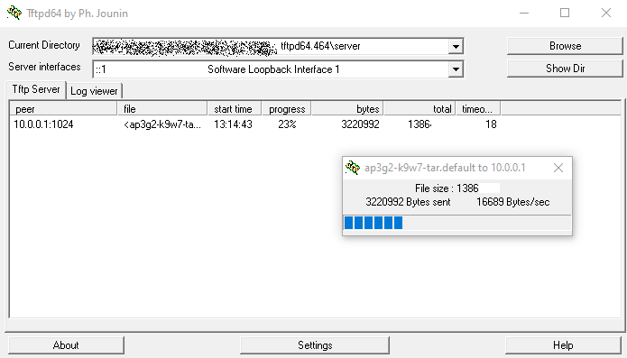

# Flashing a Cisco AP

Flashing a cisco wireless access point (AP). These are often available at enterprise auctions or online sources.

The example used here is the Cisco 3702i APs.

## Background

Cisco APs have two operating systems (both Cisco ios). Lightweight, and Autonomous. Lightweight requires a centralised (hardware) controller, so managing hundreds of APs isn't a pain (imagine shelling into every AP at a University to do a firmware update...). Autonomous allows the AP to operate without a controller, and is much more suitable for homelab operation. 

This will step through flashing an autonomous firmware file, though the process should be the same regardless.

## Getting the Firmware.

According to Cisco and their [Security Vulnerability Policy](https://sec.cloudapps.cisco.com/security/center/resources/security_vulnerability_policy.html#psi), quote

> As a special customer service, and to improve the overall security of the internet, Cisco may offer customers free software updates to address high-severity security problems. The decision to provide free software updates is made on a case-by-case basis. Refer to the Cisco security publication for details. Free software updates will typically be limited to Critical- and High-severity vulnerabilities.

> If Cisco has offered a free software update to address a specific issue, noncontract customers who are eligible for the update may obtain it by contacting the Cisco TAC using any of the methods described in the General Security-Related Queries section of this document.

> Note: To verify their entitlement, individuals who contact the Cisco TAC should have available the URL of the Cisco document that is offering the update.

If your AP is running old firmware that has has a Critical or High severity vulnerability, you _may_ be able to get Cisco firmware through this method.

## Flashing Software

The Cisco APs can be made to force flash their firmware version. Note that 802.1af (Power over Ethernet) is used, so power and data are sent over the same cable.

To flash firmware, download a tftp server (I used [tftpd64](https://pjo2.github.io/tftpd64/)) and point the tftp server at a directory that contains `ap3g2-k9w7-tar.default`.

Change your computer's IP to `10.0.0.20`.

Rename your firmware file to `ap3g2-k9w7-tar.default`

Start a tftp server, pointing the Base Directory to be the one containing the firmware file `ap3g2-k9w7-tar.default`

 - Press and hold the MODE button on the AP.
 - Plug in the AP.
 - Continue holding down the MODE button until the LED indicator shows red.
 - Release the MODE button

The tftp server should now be connected and sending the file over.

After this finishes, allow the AP to boot normally. It should now grab a DHCP address allocation from your local network and be accessible to telnet in to configure the AP.

The default credentials are `Cisco`/`Cisco`