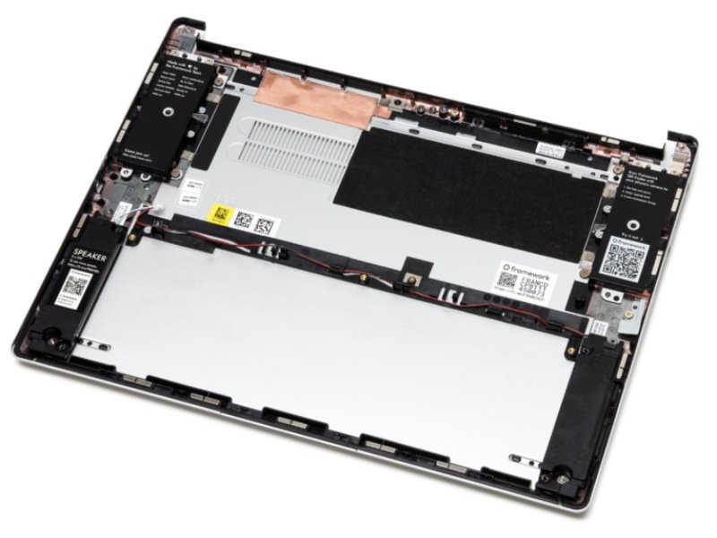
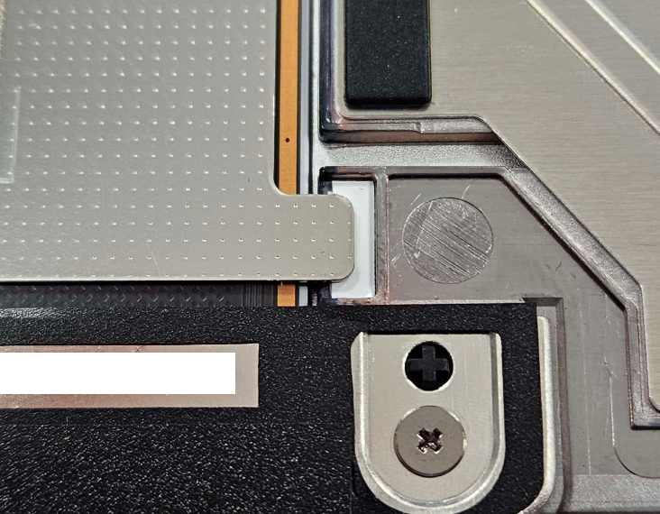

# The Framework Laptop

As some of you will know, Framework Computer Inc. has been on the scene for a few years now, but has made some notable headlines regarding their upgradable, customisable, and sustainable, laptop. The extent to which their goals have been achieved is questionable, but the intent is to be applauded.

I have been considering replacing my current laptop, but to fully understand why, background is needed regarding my computer setup.

## My Computing Setup

Unlike many people in this field, I do not have a desktop as my primary computer. I used to a few years ago, but when I replaced my 13" Macbook Pro (2015) (MacbookPro 12,1) (A1502) with an XPS 17 9700 (in late 2020), I also replaced my desktop with the XPS laptop, as it was powerful enough to fulfil both roles, and I did not need the excessive compute capability. The desktop was then turned into a storage server, which I have been utilising to this day. 

Why a laptop as opposed to a desktop? As a student I always need a laptop for studies, so will always have one. Thus, as the laptop was non-negotiable, the desktop had to go. Also desktops can be significantly more expensive than laptops, as there is not only is there the upfront cost, but you also have to consider the ongoing cost in terms of power bills. Where you live the power may not be considerable, but it is significant in my region.

The XPS 17 9700 (i7-10750H, RAM 16GB, SSD 512GB, GPU 1650 Ti), was plenty for my needs, but was quite large and unwieldy in day to day use. I was tossing up between the 15" and 17", and had decided to go with the 17" based on the better performance, thermals, and larger battery. Furthermore, all my previous computers were below 14", and I wanted to try out how a larger computer would go. The XPS was also a 17.0" screen (as opposed to 17.3" in some gaming laptops), which wasn't _too_ much larger than the 15.6" XPS 15, so did not consider the size difference to be too drastic. Unfortunately I was wrong in this aspect, but it did make for a great portable desktop replacement.

#### Laptop Docks

Laptops however, do suffer greatly in terms of usability, but there has been a solution that has existed for many years in the business world, which was seldom used in home computer, and that is the use of laptop docks. Docks are essentially overgrown USB hubs, allowing display, usb, audio, and networking, to be passed through to the laptop over a single connector, along with charging the laptop. However, up to this point, most of them were clunky ones based on massive connectors on the bottom of laptops, but notable was the development of Thunderbolt 3 enabled a much easier solution over a single cable.

I won't go on too much about the benefit of docks, but essentially _I_ find them to be an excellent solution to the problems of using a laptop as a desktop replacement. To replace my desktop _and_ laptop with the XPS 17, I bought an old Dell WD15 dock, allowing all my previous peripherals (keyboard, mouse, 2 displays, networking, etc) to work on the new machine. This worked for the longest time, but I eventually updated to a WD19TB dock, enabling higher bandwidth throughout and PCIe passthrough, but otherwise keeping most of the functionality the same.

The purchase of a WD19TB and it's ability for PCIe passthrough also led to the purchase of an eGPU enclosure, specifically a Gigabyte Aorus Gaming Box (GTX 1070). I didn't really need this compute capability, but the ability to break out Thunderbolt 3's PCIe into a full sized PCIe for PCIe cards would be great. I have some SAS drives (SAS vs SATA interface), which requires a PCIe card (LSI 9211-8i) to interface with them. An eGPU enclosure would be perfect for this application.

# Buying a New Laptop

The portability issues with the XPS, along with a scholarship opportunity from my studies, aligned in such a way that I decided to refresh my laptop. The continual progress of technology allowed a newer, lower power and more portable computer, to be almost double the performance of the XPS in CPU (with GPU remaining about the same). Having used the XPS laptop for a while now, I had the following requirements for the new laptop:

 - AMD (performance per watt, Win10 compatibility)
 - 16:10 screen
 - USB4/TB3 compatibility with PCIe Passthrough (for the dock, and eGPU/ePCIe compatibility)

After looking at the main hardware vendors (Dell had excellent laptops from their Latitude lineup, but were intel only) (HP generally didn't have anything good in my region)(ASUS doesn't really have a presence in my region)(Acer is the same story as ASUS), the only viable options were a Framework Laptop (recently released in my region, but Intel only), and the Lenovo T14s Gen3 AMD. Given the options, I decided to go with the Lenovo, especially after having some hands on time with a friend's laptop, which was the exact model but with a lower spec CPU.

Purchased, arrived, and tried it out. It worked extremely well and had no issues, except for a flicker on the screen very occasionally, probably around once per hour. This would have been acceptable as a single frame display artifact, but as I primarily use the laptop whilst docked, it would disconnect and reconnect the displays, resulting in a blank screen for 3-5 seconds. This was unacceptable, so I asked for the laptop to be RMA'd and replaced.

The replacement laptop arrived with even more issues, specifically an inconsistent `e` key (unusable for typing on the go), and trackpad rattle. After these experiences, I returned the replacement and asked for a refund, which I got.

Overall, not a _horrible_ experience, given that the customer service was good, but still left a sour taste in my mouth. This saga did last 2 months, not great, _but_, in this time, Framework announced that the Framework 13 would receive an AMD version!!! After receiving the second Lenovo laptop and having these issues, I pre-ordered the Framework and paid the deposit.

## Buying a Framework Laptop

After just over half a year of waiting, Framework ramped up their laptop production and shipped my order. 

Framework 13 AMD
 - 7840U
 - RAM 32GB
 - BYO SSD (SN-570 1TB (WD Blue))
 - US English Keyboard (no Alt-GR compared to English Int'l)

A sidebar on laptop chargers. I've gotten really used to my XPS 17's Dell Charger, which is honestly phenomenal (other than it's complete lack of 9V, 12V, and 15V rails (yeah you read that right, it's 5V1A, or 20V6.5A, only.)) The physical build is great, and having a clip and rounded body allows the charger cord to be wrapped around the charger for storage/transport (yes I unwrap it during operation, don't want any unwanted inductance in the wrapping), and easily deployed. Due this good experience, I ordered a Dell 65W USB C charger, and skipped out on the Framework Charger. Downside is that the Dell isn't GaN, so quite large compared to what the Framework charger could be, but I'm ok with this sacrifice (it's not that important anyway, and is easily replaced by a newer, smaller, one, if I wanted to get one).

The SSD Choice was originally for the Lenovo laptop, as the configurator provided by them didn't allow for anything more than 512GB, and this has slowly becoming not enough for me. I selected the SN570 as one of the cheaper, low power consumption, high write tolerance, NVMe SSDs available in my region.

After using the AMD Framework for a while, I am happy to report back that it's been a joy to use, mostly. Note I am on bios version 3.03.

#### Overall Build Quality

The build of the chassis as a whole is phenomenal, aluminium parts, though the glued in plastic tabs and such are a bit questionable. I'm used to laptop internals using something that resembles cast aluminium, providing more strength and rigidity, and the choice of plastic within an aluminium outer shell is an interesting one. You can see where the plastics are used below.

The black plastics and brass insets for screws can be plainly seen (photo credit to Framework Team at [Support](https://guides.frame.work/Guide/Bottom+Cover+Replacement+Guide/107)).

Overall though, this doesn't impact rigidity, and it's on par with my XPS 17, and only slightly behing the Macbook Pro 2015.

The screen however, is a different issue. In all the video reviews, you can see how one side of the screen would be slanted from the other, and that remains a constant in my model. The screen rigidity is abysmal when compared to the rest of the chassis, likely due to the removable bezel. This is also likely why keyboard marks on the screen was very common with the glossy display. Hopefully taking care with it in my bag and having the matte display will let me avoid this.

#### Thunderbolt Compatibility on USB 4

All functionality with the Dell WD19TB dock works without issue. Note that the dock firmware is on `01.00.32, 01.00.16` (Released on 25 May, 2023), and you may have a different experience on different versions. 

Note that TB Daisychaining has not been tested, ~~nor has using that downstream TB port as a display output.~~ Using the Downstream TB port as a display output does _not_ work.

#### PCIe Passthrough

Unfortunately, when testing with the Aorus Gaming Box (1070), the Framework laptop did not detect a new device being plugged in (no windows "new device sound"), and indeed did not charge from the Gaming Box either. Notable is a lack of drivers that I have installed for the gaming box (mixing AMD and NVidia probably isn't the best idea, and I don't intend to use it in this state anyway), so that may contribute to the non-functionality, but I would still expect that Windows detects the new device.

To be updated with more information soon.

#### Keyboard

I'll be honest, this was one of the places where I expected it to be lacking, but I was pleasently surprised. It's really nice compared to the XPS, having more travel, but slightly less tactile, and the larger keys are notably slightly mushy (especially the spacebar, but also backspace and enter suffer from this as well). Interesting is that both Shift keys don't suffer from this, but that could be based on the pinky finger being weaker than the others (especially thumbs). Overall very joyful to type on, and I could easily get to my normal typing speed on this keyboard. Also it helps that it's a smaller laptop, so my wrists naturally sit very nicely without the laptop body's edge digging into my wrists/arms.

#### Trackpad and Tape Mod

The trackpad arrived, not rattley, but had significant travel before the click would actuate. I'm pretty sure this is actually intended, as my XPS was similar (and notably did not suffer from a trackpad issue that plagued the XPS series). Regardless, this excessive travel was undesirable for me, and luckily, this laptop was made with servicability in mind! I decided to tape mod the trackpad.

Tape Modding the trackpad was quite simple, and I had also done this to my XPS laptop. It involves shimming (adding a thin material between two surfaces) the trackpad's diving board so that it sits lower, closer to the click, than stock default.

Adding tape to these two areas (black arrow)

(Image Credit to Framework's [Support](https://guides.frame.work/Guide/Touchpad+Replacement+Guide/90))

I used one layer of electical tape, and one of a generic sticker (totalling to around ~~0.32mm~~ 0.22mm of added thickness (reduced thickness due to minor issues)), which was enough for my laptop. This manufacturing tolerance will vary, so different materials may be needed for your laptop, if you choose to do this. Furthermore, I don't recommend electrical tape on the top layer, as the slight rubber quality to the tape makes it stick, creating a fake "click" as the tab un-adheres from the tape.

This makes it feel much closer to the Macbook's Force Touch/Electro-vibratory trackpad, as it both reduces click force and click travel. I would recommend, but if you haven't used Mac trackpads, then it's probably unnecessary.

#### Lid Closed Thermals

When I run the laptop docked, I have the lid shut, and use the two monitors I have on my desk as the primary display outputs. I had heard issues with the Framework laptop having thermal issues with the lid shut, but I'm happy to report that the hinge gap is large enough for thermal exhaust to exit without issue. On a prolonged Cinebench run, the CPU peaked around 85 degrees C, settling down around 75 degrees. I have not repasted, and likely won't for quite a while.

#### Laptop Hinge

The laptop hinge is.... alright. It's _very_ springy, and not very well built. I _think_ it's over-tensioned which results in the the springy action. It's interesting, and could be thought of as a mass sprint damper system, though rotationally rather than lineally. Having a high $k$ value with a low $c$ value is most of the issue, though as I say this, I don't have a fix for it. 

As far as I can tell, Macs have insanely high $c$ values with a low $k$ value, resulting in a stiff ish hinge (mostly through the damper action, as opposed to spring action).

More thoughts to come...