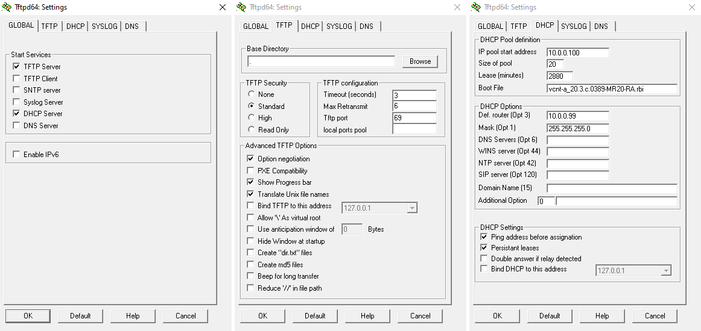

# Rooting Technicolor Gateways

For the content here, I am indebted to the work done by the folks at [Hacking Technicolor Gateways](https://hack-technicolor.readthedocs.io/), who have a much deeper understanding of the topic, and provide far more resources and support than I am able to here.

Note that this procedure may permanently damage your device.

## Background

ISP provided modem/router/firewall/switch/ap boxes/gateways are quite commonplace, but can be quite locked down and difficult to customise. I so happen to have a few of these (model number DJA0231) that were heavily locked down by the ISP, and the goal was to enable more functionality for these gateways, hopefully resulting in features similar to third party gateways (such as those from ASUS, TP-Link, etc).

I've done the Type II procedure previously, likely in late 2020 or early 2021, but had far less experience doing this, and only exploited Type II firmware. This time I have more of an idea of what's going on.

### Notes Before we Begin

#### "Partition" Layout

DJA0231 has two "banks" of firmware, which can be thought of as two partitions. ~~From my understanding, Bank I contains a clean/backup "factory default" version of the firmware, and Bank II contains the one that is loaded and run. When a factory reset is performed, the gateway copies data from Bank I to Bank II, then boots from Bank II. There's more nuiance here regarding how factory reset affects banks and switching between the two, and it's best to refer to [the "official(?)" guide](https://hack-technicolor.readthedocs.io/en/stable/Recovery/#change-booted-bank) for more information about this.~~

I've done more reading on this, and my previous explaination is wrong (see: [explaination](https://hack-technicolor.readthedocs.io/en/stable/Resources/))

Basically, there's two banks of firmware, when booting, it'll copy(?) the firmware of one of those banks into a third partition, and mount it as root `/`. It then loads the config file, stored separately again (4th partition), into runtime. Of course, linux being linux, there's _yet another_ partition to store the boot loader, so if you're keeping count, that's 5 partitions already! I'm not exactly sure if "partition" is the correct word here either, but that's a brief overview of the storage structure.


#### Firmware Types

The firmware being run by these gateways are catergorised into 3 different types.

 - Type I
 - Type II
 - Type III

Type I firmware can be flashed through the web UI, uploading a (valid) firmware file, and the gateway will do the flashing for you. This can be used to get the gateway to run type II firmware.

Type II firmware are the onle type vulnerable to exploits, used to enable root access and thus unlock functionality.

Type III firmware cannot be flashed traditionally. It needs to first flash Bank I firmware to Type II over IP, then exploit this firmware to get shell, then copy Bank I to Bank II. The gateway should now boot from Bank II.

## Flashing Type I Firmware

This was not done, as the gateways in my posession were running Type II and Type III firmware.

## Flashing Type III Firmware

This was such a painful process! Flashing Type III uses unintentional bugs/features of the gateway to flash Bank I (over IP) with Type II firmware, and then exploiting. It's known as [BOOTP Flashing](https://hack-technicolor.readthedocs.io/en/stable/Recovery/#bootp-flashing), after the protocol that it uses (bootp).

The firmware version for the gateway I had was `20.3.c.0501-MR22.1-RA` (Type III). The plan is to downgrade the firmware to `20.3.c.0389-MR20-RA` (Type II), then exploit and get root, then re-upgrade to `20.3.c.0501-MR22.1-RA` whilst retaining root access.

Step 1 is to set up TFTP so that BOOTP mode will grab the firmware file and flash.

#### TFTPd Setup

This was also quite painful, mostly due to my use of of the same config file from a previous project, causing issues with it not working properly. If you do this, I highly recommend using a fresh download. The tftp server I used was [tftpd64](https://pjo2.github.io/tftpd64/).

Ensure that DHCP is enabled on the ethernet port that will be used. Leave the modem off for this step.

Please make sure your settings match these. Note that the tftp setting's base directory has to be `.`, it did not work with anything else there (spent several hours wondering why, reinstalled with fresh config file and it worked first try)



Restart the tftp server as required. Allow through firewall (both public and private networks).

Notable with the tftp server configuration was a quirk I had experienced. When the ethernet cable was disconnected, the ethernet interface would not request a DHCP address, resulting in no IP being assigned, and the selected interface resetting to loopback (127.0.0.1). To rememdy this, I connected it to another computer, hence forcing the DHCP server to hand out appropriate addresses, and locking the "Server interfaces" to the correct interface. After this, I connected it to the modem and flashed the firmware.

#### BOOTP mode

BOOTP is an older version of DHCP, and is used by these gateways when flashing firmware over tftp. To put a DJA0231 into bootp mode,

 - Start with a completely off gateway
 - Hold down the reset button
 - Plug the gateway into power
 - Wait until the front light flashes repeatedly
 - Release the reset button

Note that throughout this procedure, the ethernet cable remains plugged into the LAN ports, and the tftp server is running on the other end of this cable.

It should then send out bootp requests over a LAN interface (I used LAN 2), which the tftp/dhcp server should respond with.

As long as the front light is flashing, the gateway is sending out bootp requests.


Your tftp server should now show a transfer occurring


Wait for this to finish flashing and allow it to boot as normal.

## Changing Banks

Now that BOOTP has successfully flashed Bank I with Type II software, we need to change the boot bank from Bank II to Bank I.

The method I used was the [Timed Reset Button Action](https://hack-technicolor.readthedocs.io/en/stable/Recovery/#timed-reset-button-action) method, holding down the reset button for 10 seconds at a time, during a specific duration of the boot sequence (when the LED indicator was dim). 

1. Start with the gateway on and fully booted.
2. Press and hold the reset button for 10 seconds.
3. The front LED should flash rainbow before showing white.
4. When the white led dims, do the following
    - Press and hold the reset button down for 10 seconds.
    - Release the reset button. Immediately re-press and hold the reset button for another 10 seconds.
    - Continue until the LED brightens again
5. Repeat step 4 for a total of three times
6. Allow gateway to fully boot.

Interestingly, this took a while to implement. Originally counting in my head did not work, nor did looking at my computer clock (which showed seconds). In these cases, the gateway would continue booting without restarting the boot process (re-starting the boot process was required for this exploit). The only method that worked was using a phone timer to time the duration of when the reset button was held down, and holding down for approximately 11 seconds, rather than 10. Furthermore, when the LED brightens again, continuing holding down for another second also helped make this procedure more consistent.

This results in Bank I's Type II firmware being booted. From here, we can exploit using Type II methods.

## Obtaining Shell on Type II Firmware

Type II software wasy relatively easy to exploit. BoLaMN provides an [extremely easy script](https://github.com/BoLaMN/tch-exploit) to accomplish this for DJA0231 gateways. Essentially:

 - Change computer IPv4 address to 58.162.0.1
 - Plug computer cable into gateway's WAN
 - Run script and follow on-screen instructions

That is all. You will(should?) get root access over ssh. (credentials `root`/`root`).

The IP address used appears to be owned by Telstra, likely so that they are able to conduct over-the-air updates.

The need to press the WPS button is interesting and notable, though only an observation.

## Optimising Bank Plans

To be honest, this part goes over my head, but in essence, we need to make our exploited Type II firmware be the default boot option.

The following command was run to print current bank tables.

```bash
find /proc/banktable -type f -print -exec cat {} ';' -exec echo ';'
```

This was followed by a Bank Plan optimisation script provided.

```bash
# Ensure two banks match in sizes
[ $(grep -c bank_ /proc/mtd) = 2 ] && \
[ "$(grep bank_1 /proc/mtd | cut -d' ' -f2)" = \
"$(grep bank_2 /proc/mtd | cut -d' ' -f2)" ] && {
# Clone and verify firmware into bank_2 if applicable
[ "$(cat /proc/banktable/booted)" = "bank_1" ] && {
mtd -e bank_2 write /dev/$(grep bank_1 /proc/mtd | cut -d: -f1) bank_2 && \
echo Verifying ... && \
[ $(sha256sum /dev/$(grep bank_1 /proc/mtd | cut -d: -f1) /dev/$(grep bank_2 /proc/mtd | cut -d: -f1) | cut -d' ' -f1 | sort -u | wc -l ) -eq 1 ] || \
{ echo Clone verification failed, retry; exit; } }
# Make a temp copy of overlay for booted firmware
cp -rf /overlay/$(cat /proc/banktable/booted) /tmp/bank_overlay_backup
# Clean up jffs2 space by removing existing old overlays
rm -rf /overlay/*
# Use the previously made temp copy as overlay for bank_2
cp -rf /tmp/bank_overlay_backup /overlay/bank_2
# Activate bank_1
echo bank_1 > /proc/banktable/active
# Make sure above changes get written to flash
sync
# Erase firmware in bank_1
mtd erase bank_1;
# Emulate system crash to hard reboot
echo c > /proc/sysrq-trigger; }
# end
```

This script intentionally crashes the gateway, and when it boots back up, the correct Type II firmware was loaded.

What exactly does it do? I have no idea. See [Bank Planning](https://hack-technicolor.readthedocs.io/en/stable/Hacking/PostRoot/#bank-planning) for explainations I guess.

After reboot, it should work on Bank II.

## Running Shell Scripts to Unlock Functionality

ok, this is the reason why we went to all that trouble to root the gateways. We can de-toxify them from ISP bloat.

They're all shell scripts, so easy and boring.

Download from seud0nym's [tch-gui-unhide repo](https://github.com/seud0nym/tch-gui-unhide), untar (`tar -xvf 20.3c.tar.gz`), scp over, chmod, and run.

I left most options as default, but changed the theme to dark mode (DARK MODE EVERYTHING!!!!) (`-tn`)

#### Other Shell Scripts

Also just for fun, I ran a screenfetch program (ufetch). Turns out, the OS is based on OpenWRT running linux!

BCM963138 Chipset running Linux 4.1.52 (OpenWRT Snapshot release) with ash shell.


Also as a fun exerp, this is the splash screen when ssh'ing in. I'm yet to try this signature drink, but will update here if I ever do.

```bash
BusyBox v1.31.1 () built-in shell (ash)

  _______              __           __              __
 |_     _|.-----.----.|  |--.-----.|__|.----.-----.|  |.-----.----.
   |   |  |  -__|  __||     |     ||  ||  __|  _  ||  ||  _  |   _|
   |___|  |_____|____||__|__|__|__||__||____|_____||__||_____|__|
                 N E X T   G E N E R A T I O N   G A T E W A Y
 --------------------------------------------------------------------
 NG GATEWAY SIGNATURE DRINK
 --------------------------------------------------------------------
  * 1 oz Vodka          Pour all ingredients into mixing
  * 1 oz Triple Sec     tin with ice, strain into glass.
  * 1 oz Orange juice
 --------------------------------------------------------------------
```

## Upgrading Firmware Whilst Keeping Root

Now that we've rooted the gateway, we can re-upgrade it to a newer version whilst keeping root access.

Copy the `.rbi` file onto the gateway, move it to `/tmp/new.rbi`, and extract using

```bash
cat "/tmp/new.rbi" | (bli_parser && echo "Please wait..." && (bli_unseal | dd bs=4 skip=1 seek=1 of="/tmp/new.bin"))
```

The script might take a while, the cpu isn't very powerful. Furthermore, it forced a modem restart when I was attempting, which is apparently a RAM issue

To remedy, I substituted `/tmp/` for a USB (`/mnt/usb/USB-A1/`), and re-ran the script

```bash
cat "/mnt/usb/USB-A1/new.rbi" | (bli_parser && echo "Please wait..." && (bli_unseal | dd bs=4 skip=1 seek=1 of="/tmp/new.bin"))
```

How does this help? I have no idea! Maybe it uses some of the USB as a swap partition?

Anyways trying that also yields a crash. I may revisit this another time, but I'm done here for now.


