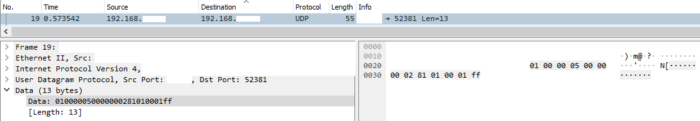

# VISCA over IP Experimentation

VISCA is a real time control scheme for Audio/Video devices, and is mostly targeted as PTZ Cameras (Point-Tilt-Zoom).

There's a bunch of solutions available from large vendors, but I'm looking to run it on a linux machine.

Guess what most of the large vendors don't provide? That's right, linux executables. God damnit.

Not all hope is lost, there's a few resources available, the first one I tried out was the OBS VISCA plugin.

## VISCA in OBS 

OBS runs in Linux, so that box is ticked.

This uses a few `.lua` scripts by vwout available as [an OBS plugin](https://github.com/vwout/obs-visca-control), which enables control of cameras after specifying an IP and Port. 

It's relatively simple, and works well... until it doesn't. For some reason that I can't figure out, on certain networks or in certain configurations, VISCA over OBS will not work, or will be very delayed (~3s or more), or will only step the camera in 45 degree increments (unacceptable). When it does work though, it is flawless, with near-instant response from the camera when buttons are pressed and released.

Due to this unreliability, this scripting method was discounted.

## VISCA in Python

Interestingly, there is a VISCA over IP library for python, installable using `pip install visca_over_ip`. 

This python script, man this python script. It works so well. It allows cameras to be controlled both using turn speed (and direction), as well as absolute position (though the coordinate system isn't intuitive). One downside for the absolute positioning is the inability to handle negative numbers.

An example script is provided, that moves the camera to the upper right position, then returns to home.

```py
import time
from visca_over_ip import Camera
cam = Camera('192.168.0.154')

cam.pantilt(pan_speed=24, tilt_speed=24, pan_position=6000, tilt_position=3000)
time.sleep(2)
cam.pantilt(pan_speed=24, tilt_speed=24, pan_position=0, tilt_position=0)
time.sleep(2)
```

## Personal Investigations

VISCA uses UDP (makes sense for a real time control system), and by only specifying a destination port number, raw data can be sent to control the cameras. The raw bytes depends on the camera vendor, with each camera having a large table specifying the exact bytes for each command.



This probably explains the simplicity of the python library, by simply sending raw data bytes for the cameras.

It doesn't explain why the OBS solution didn't work, as it should be a simple script to do so.

More updates to come, hopefully.